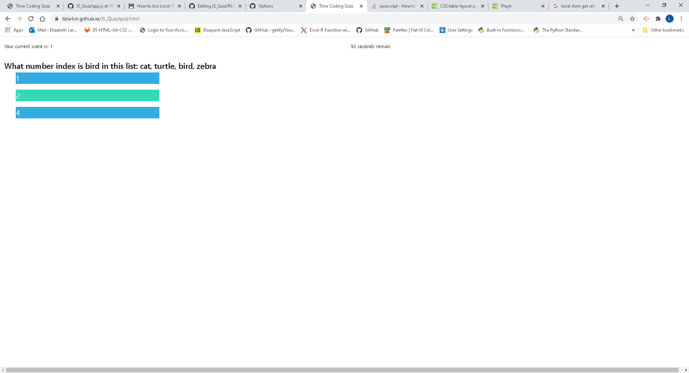

# JavaScript Quiz

The point of this project was to practice APIs. A simple HTML file with a handful of divs is transformed into
a user-guided quiz via JavaScript. The user initiates a 60 second timer when thehy click the start button, and
are guided through questions, losing time for each wrong answer. The user's score is kept as they go, and at the
end of the game they can preview their score and input their name.

I tried tirelessly to include a score history of user names and scores within an object stored in local
memory, using get and set functions. I will revist this and add it in.

Link to deployed site: https://lizlarkin.github.io/JS_Quiz/quiz.html

Screenshot:

